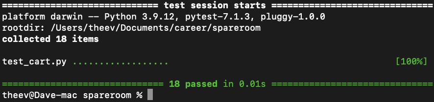

# Shopping-Cart
Sofware development test

## Introduction
This is a simple checkout system that produces a subtotal in a CLI based on pricing data (see below). 

##### Pricing dataset
Item Code  | Unit Price | Special Price
---------- | ---------- | ----------
A          | £50        | 3 for £140
B          | £35        | 2 for £60
C          | £25        |
D          | £12        |

##### Data source
`[{"code":"A","quantity":3},{"code":"B","quantity":3},{"code":"C","quantity":1},{"code":"D","quantity":2}]`

##### CLI
The CLI is mainly split into two paths. The first path is used for quick testing. In the testing path a user can recieve an output of a cart based on
the data source currenly set at the bottom of the Main.py file.

The secound path in the CLI allows users to create their own cart. By following the various outputs and inputs, users could add and edit items in the cart.
There is range of validation checks to ensure no crashing takes places during the process. After the editing is completed, a cart summary is presented
with a subtotal.

## Requirements
##### installs
* Python 3.9+ should be downlaoded and used either in an idle of choice or a python shell. see the link for installation https://www.python.org/downloads/
* (Optional) Install pytest to perform your own unit testing. Command line install pip install -U pytest
##### Files to download
Main.py, Cart.py and optionally test_cart.py should be downloaded and placed in the same directory.

## Testing
Unit testing was conducted using the pytest framework. The tests were coded in test_cart.py. The main focus of the testing was to ensure the methods 
in the Cart.py class worked with a range of scenarios.

